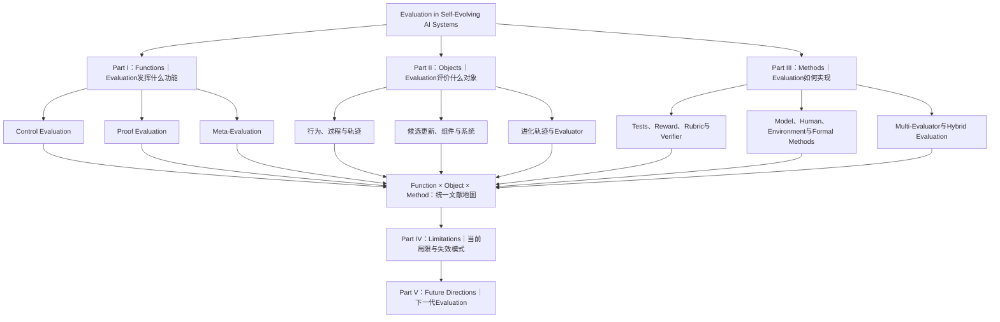

# Evaluation in Self-Evolving AI Systems：综述设计概览

## 相关文档

- [英文期刊文献深度研究报告](data/research-report.md)：收录检索策略、50 篇核心期刊文献、跨文献比较、研究局限与未来方向。
- [参考文献库](data/references.bib)：收录与综述主题相关的 BibTeX 条目。

## 1. 综述定位

本综述系统讨论 **Evaluation 在 Self-Evolving AI Systems 中承担的功能、评价的对象、实现方法、现有局限和未来发展方向**。

与主要关注“什么组件能够进化”或“如何实现系统自我更新”的现有综述不同，本文将 Evaluation 视为 Self-Evolution 的核心基础设施：它不仅测量系统性能，还定义进化目标、感知能力缺口、提供改进信号、选择候选更新、验证真实进步，并在必要时更新评价体系本身。

全文围绕五个问题展开：

1. **Function：** Evaluation 在 Self-Evolving AI 中发挥什么功能？
2. **Object：** Evaluation 具体评价什么对象？
3. **Method：** Evaluation 通过哪些方法实现？
4. **Limitation：** 现有 Evaluation 存在哪些局限和失效模式？
5. **Future：** 下一代 Evaluation 应该向什么方向发展？

前三部分从功能、对象和方法三个互补维度建立文献地图；第四部分综合现有研究的共同问题；第五部分根据这些问题提出未来研究议程。

---

## 2. 综述整体架构



该架构的核心不是将五个部分简单并列，而是形成两阶段逻辑：

- **Part I–III：描述和组织现有研究；**
- **Part IV–V：综合现有问题并形成未来研究路线。**

---

## 3. Part I：Functions of Evaluation in Self-Evolving AI

### 核心问题

> Evaluation 为什么存在？它在 Self-Evolution 中发挥什么功能？

本部分是全文的理论核心。文章首先梳理 Evaluation 在 Self-Evolution 生命周期中的具体功能，再将这些功能归纳为 Control Evaluation、Proof Evaluation 和 Meta-Evaluation 三类角色。

### 主要内容

#### 3.1 Evaluation as Objective

- 定义什么是“更好”的系统；
- 将任务目标、用户偏好、安全要求和成本约束转化为评价标准；
- 为系统进化提供 Fitness、Reward 或 Rubric。

#### 3.2 Evaluation as Sensor and Trigger

- 检测任务失败、能力缺口、不确定性和分布变化；
- 判断系统是否需要进化；
- 判断何时进化以及应该更新哪个组件。

#### 3.3 Evaluation as Diagnostician and Teacher

- 分析失败原因并进行 Credit Assignment；
- 识别 Model、Memory、Tool 或 Workflow 中的问题；
- 提供 Reward、Critique、Process Feedback、Demonstration 或 Counterexample。

#### 3.4 Evaluation as Selector and Gatekeeper

- 比较、排序和选择候选更新；
- 选择父代、维护 Archive、分配搜索预算；
- 决定 Accept、Reject、Commit 或 Rollback。

#### 3.5 Evaluation as Challenger

- 生成更困难的任务、反例和对抗样本；
- 构建 Curriculum 和新的进化压力；
- 持续暴露系统和 Evaluator 的能力边界。

#### 3.6 Evaluation as Proof

- 独立验证系统是否真正提高；
- 测量能力保持、泛化、累积性、稳定性、效率和安全性；
- 区分内部评价提高与真实进化。

#### 3.7 Evaluation as an Evolving Component

- 审计和校准 Evaluator；
- 更新 Reward、Rubric、Metric、Verifier 和 Test Suite；
- 研究 Policy–Evaluator Co-Evolution；
- 通过外部证据控制 Evaluator Promotion 和 Rollback。

### 三类核心角色

| 核心角色 | 主要功能 |
| --- | --- |
| **Control Evaluation** | 定义目标、检测缺口、诊断错误、提供反馈、选择候选、控制准入和生成挑战 |
| **Proof Evaluation** | 独立验证能力提升、保持、泛化、累积性、效率和安全 |
| **Meta-Evaluation** | 审计、校准、更新和治理评价体系本身 |

本部分最终强调：Control–Proof–Meta 是对 Evaluation 功能的高层归纳，而不是三种固定的模型或实现技术。

---

## 4. Part II：Objects of Evaluation in Self-Evolving AI

### 核心问题

> Evaluation 具体评价什么？

本部分按照评价对象和评价粒度组织文献，并区分 **Evaluation Object** 与 **Evolution Object**：前者是 Evaluator 直接观察和判断的内容，后者是系统最终修改的组件。

### 主要内容

#### 4.1 Behavior-Level Objects

- 最终输出、答案、代码、计划和动作；
- 推理步骤、工具调用和状态转换；
- Task Success、Correctness 和 Safety Outcome。

#### 4.2 Process- and Trajectory-Level Objects

- Reasoning Process；
- Planning and Execution Trajectory；
- Tool-Use Trace；
- Embodied Interaction；
- Multi-Agent Communication。

#### 4.3 Experience- and Data-Level Objects

- 哪些经验值得保留、压缩、合并或删除；
- 哪些训练样本具有学习价值；
- 哪些失败和反例适合进入下一轮进化。

#### 4.4 Update- and Component-Level Objects

- Parameter、Prompt 和 Memory 更新；
- Tool、Skill、Workflow 和 Harness 修改；
- Agent Architecture、Curriculum 和 Environment 变化。

#### 4.5 System- and Evolution-Level Objects

- 完整 Agent System；
- System Snapshot；
- Snapshot Sequence；
- Evolutionary Lineage、Population 和 Archive；
- 完整 Self-Evolution Run。

#### 4.6 Evaluator-Level Objects

- Reward Model、Verifier 和 LLM Judge；
- Rubric、Metric 和 Test Suite；
- Challenge Generator 和 Evaluation Protocol。

本部分将建立从局部行为到完整进化过程的评价粒度体系：

```text
Step → Action → Trajectory → Episode → Update → Component → System → Evolution → Evaluator
```

---

## 5. Part III：Methods for Evaluation in Self-Evolving AI

### 核心问题

> Evaluation 的不同功能通过哪些方法实现？

本部分比较不同 Evaluator、评价信号和评价组织方式，分析它们分别适合哪些功能和对象。

### 主要内容

#### 5.1 Criteria and Signal Representations

- Scalar Reward；
- Binary Pass/Fail；
- Preference and Ranking；
- Rubric；
- Constraint；
- Textual Critique；
- Counterexample；
- Certificate and Confidence。

#### 5.2 Ground-Truth and Reference-Based Evaluation

- Gold Answer；
- Reference Output；
- Expert Demonstration；
- Labeled Preference。

#### 5.3 Executable and Environment-Based Evaluation

- Unit Test、Compiler 和 API State；
- Simulator 和 Environment Reward；
- Task Success 和 Physical Outcome。

#### 5.4 Formal Evaluation

- Theorem Prover；
- Constraint Solver；
- Model Checking；
- Type Checking；
- Symbolic Verification。

#### 5.5 Human- and Model-Based Evaluation

- Expert Review、User Feedback 和 Human Preference；
- LLM-as-a-Judge、Reward Model、Critic Model 和 Process Reward Model。

#### 5.6 Multi-Evaluator and Hybrid Evaluation

- Evaluator Ensemble；
- Multi-Agent Debate；
- Judge–Challenger；
- Cross-Model Review；
- Human–AI Hybrid Evaluation。

#### 5.7 Temporal and Access Protocols

- Step、Episode、Update、Generation 和 Epoch-level Evaluation；
- Online、Offline 和 Periodic Audit；
- Public、Hidden、Sealed 和 Accept/Reject-only Evaluation。

#### 5.8 Evaluation Infrastructure

- Static Benchmark；
- Sequential Task Stream；
- Dynamic Environment；
- Snapshot and Replay Evaluation；
- Held-out ID/OOD Evaluation；
- Safety Stress Test 和 Cost Accounting。

本部分最终形成一张“功能—对象—方法”对照表，用于说明不同 Evaluation 方法的适用范围、成本、可靠性和可扩展性。

---

## 6. Part IV：Limitations of Evaluation in Self-Evolving AI

### 核心问题

> 为什么现有 Evaluation 仍然不足以支持长期、开放和可信的 Self-Evolution？

本部分不再简单罗列论文，而是综合前三部分暴露出的共同问题。

### 主要内容

#### 6.1 Functional Limitations

- 评价信号只能打分，不能诊断或指导更新；
- 结果评价无法反映过程质量；
- 难以在正确性、安全性和效率之间进行多目标权衡。

#### 6.2 Object and Attribution Limitations

- 过度关注最终输出，忽略过程和组件交互；
- 多组件同时更新时难以进行因果归因；
- 缺少 Snapshot 和长期 Evolutionary Trajectory。

#### 6.3 Methodological Limitations

- Ground Truth 在开放任务中缺失；
- Tests 覆盖不完整并可能被针对性优化；
- LLM Judge 存在偏差、不稳定性和可攻击性；
- Human Evaluation 昂贵且难以扩展；
- Environment Feedback 稀疏、延迟或部分可观测。

#### 6.4 Optimization-Induced Failures

- Reward Hacking；
- Goodhart Effect；
- Specification Gaming；
- Verifier Exploitation；
- Benchmark Overfitting；
- Test Leakage。

#### 6.5 Evolution-Specific Limitations

- 评价目标随系统能力变化而非平稳；
- 新能力获得和旧能力遗忘可能同时发生；
- 中间版本可能退化、振荡或崩溃；
- Policy 和 Evaluator 可能共同过拟合或共同作弊。

#### 6.6 Evidence and Governance Limitations

- Control 信号与最终进化证据混用；
- 只报告最优版本而忽略失败更新；
- 缺少独立测试、成本、安全和保持评价；
- Evaluator 更新缺少外部 Anchor；
- Evaluator 可能参与对自己的评价和批准。

---

## 7. Part V：Future Directions for Evaluation in Self-Evolving AI

### 核心问题

> 下一代 Self-Evolving AI 需要什么样的 Evaluation？

本部分根据 Part IV 的具体局限提出对应的研究方向，避免脱离前文泛泛讨论未来工作。

### 主要内容

#### 7.1 Multi-Level Evaluation

联合评价 Outcome、Process、Component、System 和 Evolutionary Trajectory。

#### 7.2 Component-Aware and Causal Evaluation

识别不同组件对性能提升或退化的真实贡献，支持多组件联合进化的 Credit Assignment。

#### 7.3 Longitudinal Evaluation

从静态分数转向 Snapshot Curve、Retention、Forgetting、Recovery、Stability 和 Cumulative Improvement。

#### 7.4 Adaptive and Co-Evolving Evaluation

随着系统能力变化更新 Rubric、Metric、Tests 和 Challenge，同时保留独立的外部 Anchor。

#### 7.5 Scalable Hybrid Evaluation

组合 Executable Test、Environment Feedback、LLM Judge、Formal Method 和 Human Audit，根据风险与不确定性动态选择评价方式。

#### 7.6 Open-World and Embodied Evaluation

面向部分可观测、反馈稀疏、交互昂贵和安全关键的开放环境与具身系统设计评价机制。

#### 7.7 Standardization and Reproducibility

建立统一术语、Evaluator Versioning、Snapshot Reporting、Cost Accounting、Failure Reporting 和 Evidence Provenance。

---

## 8. 建议的论文整体目录

1. **Introduction**
2. **Background, Scope, and Review Methodology**
3. **Functions of Evaluation in Self-Evolving AI**
4. **Objects of Evaluation in Self-Evolving AI**
5. **Methods for Evaluation in Self-Evolving AI**
6. **Limitations of Evaluation in Self-Evolving AI**
7. **Future Directions for Evaluation in Self-Evolving AI**
8. **Conclusion**

其中：

- Introduction 负责提出 Evaluation 从静态测量工具转变为 Self-Evolution 核心机制的研究动机；
- Background 负责定义 Self-Evolution、Evaluation 及相关概念，并说明文献检索方法；
- Part I–III 构成综述的主体文献分类；
- Part IV–V 负责综合研究缺口并提出研究议程；
- Conclusion 回到全文核心判断，概括 Evaluation 对 Self-Evolving AI 的基础性作用。

---

## 9. 综述的核心观点

本文最终希望建立以下认识：

> Evaluation in Self-Evolving AI is not merely a post-hoc measurement procedure. It defines what constitutes progress, senses when evolution is needed, diagnoses failures, guides and selects updates, verifies whether improvement is genuine, and evolves to remain effective as the system changes.

其中最重要的结构性原则是：

> **Control Evaluation 指导和控制进化，Proof Evaluation 验证真实进步，Meta-Evaluation 审计和更新评价体系；三者共同构成 Self-Evolving AI 的 Evaluation System。**
