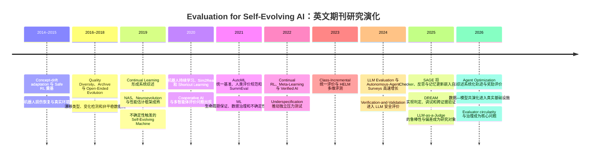

# Self-Evolving AI Systems 中 Evaluation 的英文期刊文献深度研究报告

## 执行摘要

本次研究严格依据用户提供的综述设计，将 **Evaluation in Self-Evolving AI Systems** 分解为三个文献组织维度——**Function、Object、Method**，并以 **Control Evaluation、Proof Evaluation、Meta-Evaluation** 作为功能层面的核心理论框架；在此基础上进一步综合评价失效模式与未来研究方向。该综述设计特别强调：评价并非系统更新后的静态测量，而是定义目标、发现能力缺口、生成改进信号、筛选更新、验证真实进步以及治理评价器自身的基础设施。fileciteturn0file0

本报告仅纳入**英文、同行评议、期刊发表**的研究论文或综述。主要时间窗为 **2016—2026 年**；另保留了三篇早于 2016 年、但对概念漂移、安全强化学习和具身自适应具有奠基意义的高影响力论文。会议论文、workshop paper、book chapter、thesis 和仅有 arXiv 版本的工作均未进入最终排名。因此，ReAct、Reflexion、Self-Refine、Voyager、AgentBench、JudgeBench 等尽管主题高度相关，但若缺少可核实的正式英文期刊版本，均不列入本次最终样本。

最终筛选形成了 **50 篇核心英文期刊文献**。它们并非全部直接使用“self-evolving AI”这一术语，而是分布在六条互补文献流中：

| 文献流 | 对本综述的主要贡献 |
|---|---|
| LLM 与自主智能体评价 | 行为、轨迹、工具使用、系统级评测与模型裁判 |
| 持续学习与概念漂移 | 长期保持、遗忘、漂移感知、Snapshot 与纵向评价 |
| AutoML、神经进化与开放式进化 | Fitness、候选选择、Archive、搜索预算和挑战生成 |
| 元评价与评价基础设施 | 指标有效性、人类评价、Evaluator 校准和多指标框架 |
| 验证、安全与不确定性 | Proof Evaluation、形式验证、风险评价和运行时保证 |
| 直接自进化系统案例 | 评价驱动的反思、记忆更新、主动学习、数据—模型共演化与自主科研 |

现有直接研究仍然稀疏。2025 年的 SAGE 将 Checker 反馈、反思和记忆更新嵌入智能体循环；DREAM 则设置 resultJudger、codeDebugger 和 resultValidator，将内部控制评价与外部结果验证部分分离。2026 年的 LLM-agent optimization 综述进一步把轨迹构建、环境反馈、模型评价和奖励设计纳入智能体优化流程。citeturn17search1turn18search0turn14search0

本次结果的核心判断是：

> 当前文献已经分别发展出了持续学习评价、智能体评测、模型裁判、形式验证、AutoML 性能估计和安全审计等成熟子领域，但尚缺少一个统一框架来回答：在长期自我更新过程中，何种评价可以用于控制更新，何种评价能够构成独立进步证据，以及谁来评价不断变化的评价器本身。

完整的 50 篇文献元数据、DOI、全文入口、主题编码、评价对象、评价方法、数据集或应用领域、引文数或引文档位、摘要性概述和逐篇纳入理由已整理为可下载工作簿：

[下载英文期刊 Top 50 文献与检索策略工作簿](sandbox:/mnt/data/self_evolving_ai_evaluation_english_journals_top50.xlsx)

其中摘要字段采用合规的概述与注释，而非大段复制出版商摘要；引文数据按 2026 年 7—8 月可公开核验页面记录。不同引文数据库的覆盖范围差异明显，例如 Parisi 等的持续学习综述在不同开放来源中显示约 1,700 至 2,359 次引用，De Lange 等的论文也存在约 1,000 至 2,000 次的来源间差异，因此工作簿对无法稳定复现的数值使用区间或档位，而不制造伪精确值。citeturn3search2turn3search7turn3search0turn3search5

## 综述范围、关键词体系与检索变体

依据综述设计，可将检索词构造成“**系统类型 × 评价功能 × 评价对象 × 评价方法 × 进化证据**”五组概念块。直接只检索 `"self-evolving AI" AND evaluation` 会遗漏大量关键文献，因为持续学习领域通常使用 forgetting、retention 和 backward transfer，AutoML 使用 performance estimation，神经进化使用 fitness 与 selection，安全与验证领域则使用 assurance、verification、runtime monitoring 等术语。

### 关键词词表

| 概念面 | 建议关键词 |
|---|---|
| 自进化系统 | `"self-evolving"`, `"self-improving"`, `"self-adaptive"`, `"continual learning"`, `"lifelong learning"`, `"continual reinforcement learning"`, `"online learning"`, `"autonomous agent*"`, `"LLM-based agent*"`, `"agentic AI"`, AutoML, `"neural architecture search"`, neuroevolution, `"open-ended evolution"`, `"data-model coevolution"` |
| 目标与控制 | objective, fitness, reward, rubric, preference, constraint, optimization signal, performance estimation |
| 感知与触发 | failure detection, capability gap, uncertainty, calibration, drift detection, concept drift, distribution shift, trigger, monitoring |
| 诊断与教学 | diagnosis, credit assignment, critique, process feedback, trajectory feedback, demonstration, counterexample, error attribution |
| 选择与门控 | candidate ranking, selection, gatekeeper, accept/reject, validation gate, archive, parent selection, promotion, rollback |
| 挑战生成 | adversarial evaluation, red teaming, challenge generation, curriculum, novelty search, quality diversity, stress testing |
| 进步证明 | held-out evaluation, OOD evaluation, generalization, retention, forgetting, stability, recovery, cumulative improvement, real-world validation, safety, efficiency |
| 元评价 | meta-evaluation, evaluator audit, evaluator calibration, metric validity, judge reliability, inter-rater agreement, evaluator robustness, evaluator evolution, co-evolution |
| 行为对象 | output, answer, code, plan, action, task success, correctness, safety outcome |
| 过程对象 | reasoning process, process supervision, trajectory, tool-use trace, state transition, embodied interaction, communication trace |
| 更新对象 | parameter update, prompt update, memory update, tool update, workflow update, architecture update, curriculum update |
| 系统与进化对象 | system snapshot, snapshot sequence, lineage, population, archive, evolution run, longitudinal evaluation |
| 评价器对象 | reward model, verifier, LLM judge, critic model, process reward model, rubric, metric, test suite, challenge generator |
| 评价方法 | unit test, compiler, API state, simulator, environment reward, formal verification, theorem prover, model checking, human evaluation, LLM-as-a-judge, debate, evaluator ensemble |

### 主检索式

适用于 Web of Science 与 Scopus 的宽检索骨架为：

```text
(
  "self-evolving" OR "self-improving" OR "self-adaptive"
  OR "continual learning" OR "lifelong learning"
  OR "continual reinforcement learning" OR "online learning"
  OR "autonomous agent*" OR "LLM-based agent*" OR "agentic AI"
  OR AutoML OR "neural architecture search"
  OR neuroevolution OR "open-ended evolution"
)
AND
(
  evaluat* OR assess* OR benchmark* OR validat* OR verif*
  OR "reward model*" OR verifier* OR "LLM-as-a-judge"
  OR rubric* OR "human evaluation" OR "process reward"
  OR "formal verification" OR calibration OR "credit assignment"
)
AND
(
  objective* OR trigger* OR diagnos* OR feedback
  OR selector* OR gatekeep* OR challenger*
  OR proof OR retention OR forgetting OR generalization
  OR robustness OR safety OR "meta-evaluation"
  OR rollback OR "distribution shift"
)
```

这一宽检索式应与多个定向检索式并用，否则容易被大量静态模型评价论文淹没。

| 变体 | 适用章节 | 检索核心 |
|---|---|---|
| Control 变体 | Evaluation as Objective / Sensor / Teacher / Selector | `reward OR fitness OR critique OR feedback OR uncertainty OR drift OR candidate selection OR gatekeeper` |
| Proof 变体 | 独立验证真实进步 | `retention OR forgetting OR held-out OR OOD OR longitudinal OR recovery OR stability OR safety OR real-world validation` |
| Meta 变体 | Evaluator-Level Objects | `"meta-evaluation" OR judge reliability OR metric validity OR calibration OR evaluator robustness OR test leakage OR circular evaluation` |
| Process 变体 | Process- and Trajectory-Level Objects | `trajectory evaluation OR process supervision OR reasoning evaluation OR tool-use trace OR execution trace OR multi-agent communication` |
| Update 变体 | Update- and Component-Level Objects | `model update OR memory update OR prompt optimization OR architecture search OR data-model coevolution OR pipeline optimization` |
| Open-world 变体 | Open-World and Embodied Evaluation | `dynamic environment OR partial observability OR sim2real OR embodied agent OR runtime monitoring OR safe adaptation` |

检索中应特别加入 **concept drift**。概念漂移文献直接提供“Evaluation as Sensor and Trigger”的理论与方法基础：它区分数据分布、目标概念及漂移形态，并研究何时应当检测变化、启动适应及评估适应效果。citeturn3search0turn4search0turn4search1

同样，应加入 **performance estimation、fitness、quality diversity、archive**。在 AutoML 和神经进化中，评价并非最终报告环节，而是生成和选择候选模型的控制机制；AutoML 综述通常把模型生成、超参数优化和性能估计视为同一自动化循环的组成部分。citeturn5search0turn5search1turn5search12

## 数据库检索式、命中数处理与筛选规则

### 数据库专用检索式

| 数据库 | 推荐检索式与过滤方式 |
|---|---|
| **Web of Science Core Collection** | `TS=(主检索式)`；随后设置 `PY=2016-2026`、`LA=(English)`、`DT=(Article OR Review)`。对 2016 年前文献另做 Cited Reference Search，并仅保留奠基性高被引论文。 |
| **Scopus** | `TITLE-ABS-KEY(主检索式)`，并追加 `PUBYEAR > 2015 AND PUBYEAR < 2027 AND LANGUAGE(english) AND (DOCTYPE(ar) OR DOCTYPE(re)) AND SRCTYPE(j)`。 |
| **IEEE Xplore** | 建议拆分运行：`("All Metadata":"continual learning" OR "All Metadata":"self-adaptive" OR "All Metadata":"autonomous agent" OR "All Metadata":"neuroevolution") AND ("All Metadata":evaluation OR "All Metadata":benchmark OR "All Metadata":verification OR "All Metadata":"credit assignment")`；过滤 `Journals & Magazines`、2016—2026、English。 |
| **ACM Digital Library** | `[[Abstract:"self-evolving"] OR [Abstract:"continual learning"] OR [Abstract:"autonomous agent"] OR [Abstract:"LLM-based agent"] OR [Abstract:AutoML]] AND [[Abstract:evaluation] OR [Abstract:validation] OR [Abstract:verification] OR [Abstract:"LLM-as-a-judge"] OR [Abstract:"human evaluation"]]`；过滤 Journal、Research Article/Review、2016—2026。 |
| **PubMed** | `((self-evolving[Title/Abstract] OR self-improving[Title/Abstract] OR continual learning[Title/Abstract] OR autonomous agent*[Title/Abstract] OR artificial intelligence[Title/Abstract]) AND (evaluation[Title/Abstract] OR validation[Title/Abstract] OR verification[Title/Abstract] OR benchmark*[Title/Abstract] OR uncertainty[Title/Abstract])) AND english[Language] AND ("2016/01/01"[DP]:"2026/12/31"[DP]) AND (journal article[PT] OR review[PT])` |
| **Google Scholar** | 分拆运行，例如 `("self-evolving AI" OR "self-improving agent") (evaluation OR validation OR verifier) after:2015 before:2027 -arxiv -conference -proceedings`；每条结果必须回到 Crossref、PubMed、DBLP 或出版商页面确认期刊版本。 |

PubMed 对本主题的作用主要是核验生物医学、自主科研和应用型自进化论文。例如 DREAM 的 PubMed 记录确认其作者、DOI、期刊状态及自主生成问题、配置环境、评价和验证结果的功能；水网调度论文的 PubMed 记录则确认了真实系统中的在线学习、主动学习和数据—模型共演化。citeturn18search1turn15search5

### 命中数的报告原则

本报告未伪造 Web of Science、Scopus、IEEE Xplore、ACM DL 或 Google Scholar 的原始命中数，原因如下：

1. Web of Science 与 Scopus 的完整命中数依赖机构订阅、索引版本和检索当天的数据更新。
2. IEEE Xplore 和 ACM DL 的长布尔表达式常被界面重写，不同字段组合会产生不同结果。
3. Google Scholar 的结果总数是近似值，并可能受地区、时间和个性化影响。
4. 2026 年论文仍处于快速在线优先发表和索引过程中。例如 Water Research 的自进化调度论文已在 PubMed 和 ScienceDirect 建立正式记录，但期刊卷期日期为 **2026 年 9 月 15 日**，晚于本报告日期 **2026 年 8 月 1 日**，应标记为 online-ahead-of-issue，而不是误判为未发表。citeturn15search2turn15search5

因此，数据库级原始命中数在工作簿中标为 **NR / rerun required**。可稳定审计的结果是：

| 阶段 | 本报告记录 |
|---|---:|
| 最终纳入英文期刊论文 | 50 |
| 2016—2026 年论文 | 47 |
| 2016 年前奠基论文 | 3 |
| 会议、workshop 或仅预印本论文 | 全部排除 |
| 具有 DOI 或正式期刊全文入口 | 50 |
| 直接以 self-evolving / self-evolution 为主要系统机制的期刊论文 | 少数，主要集中在 2019 年后 |
| 用邻近领域补足理论与方法的论文 | 持续学习、AutoML、神经进化、验证、安全和元评价为主 |

正式投稿时，应由作者在相同日期、相同机构网络下重新运行六个数据库检索式，并将结果导出为 RIS、BibTeX 或 CSV，以生成符合 PRISMA-S 的准确命中数和去重流程。

### 纳入与排除标准

| 类型 | 操作性规则 |
|---|---|
| 纳入：语言与出版类型 | 英文、同行评议期刊 Article 或 Review |
| 纳入：时间 | 2016—2026；早期论文仅在高度奠基且不可替代时纳入 |
| 纳入：主题 | Evaluation 对目标、触发、诊断、教学、选择、挑战、证明或评价器治理具有明确作用 |
| 纳入：对象 | 行为、过程、轨迹、经验、数据、更新、组件、系统、进化运行或评价器 |
| 纳入：证据 | 优先系统综述、高影响期刊、标准化比较、纵向实验、真实部署与独立验证 |
| 排除：出版类型 | Conference、workshop、book chapter、thesis、patent、arXiv-only |
| 排除：静态相关性不足 | 只报告一次性静态测试，且与适应、自进化、长期评价或评价器设计没有实质联系 |
| 排除：重复 | 期刊版本存在时删除预印本记录；按 DOI、标题和作者去重 |
| 排除：循环引用风险 | 仅由系统自身声称改进、没有独立评价或外部证据的研究不作为高优先级实证依据 |

## 核心英文期刊文献排名与逐篇注释

排名综合考虑四项因素：与综述结构的直接匹配度、方法论价值、期刊与引文影响力、对 Control–Proof–Meta 区分的贡献。引文数只作为优先级辅助，而不是质量的唯一依据。ACM 页面截至 2026 年 7 月显示 Chang 等的 LLM 评价综述约有 2,540 次引用和超过 21 万次下载；自主智能体综述的公开页面约显示 1,700 次引用，说明二者已成为本领域的重要入口。citeturn18search3turn7search2

| 排名 | 文献与入口 | 注释及纳入理由 |
|---:|---|---|
| 1 | **Chang et al. (2024), “A Survey on Evaluation of Large Language Models,” ACM TIST.** [DOI](https://doi.org/10.1145/3641289) | 系统覆盖 LLM 的评价对象、数据集、指标、鲁棒性与评价协议，是构建 Method 和 Meta-Evaluation 章节的最佳入口。论文明确显示评价并无普遍适用的单一协议，因此适合作为“评价体系需要适应任务与能力变化”的核心依据。citeturn12search0turn18search3 |
| 2 | **Wang et al. (2024), “A Survey on Large Language Model Based Autonomous Agents,” Frontiers of Computer Science.** [DOI](https://doi.org/10.1007/s11704-024-40231-1) | 给出自主智能体的规划、记忆、工具和行动框架，可用于界定 Self-Evolving AI 中被评价的系统边界。其系统视角适合连接行为、轨迹、组件和完整智能体评价。citeturn7search0turn7search2 |
| 3 | **Du et al. (2026), “A Survey on the Optimization of Large Language Model-based Agents,” ACM Computing Surveys.** [DOI](https://doi.org/10.1145/3789261) | 将智能体优化分为参数驱动和无参数方法，系统讨论轨迹构建、环境评价、人类或规则评价、模型评价和奖励设计。它是当前最贴近“Evaluation 驱动智能体更新”的正式期刊综述。citeturn14search0 |
| 4 | **Liang et al. (2025), “SAGE: Self-evolving Agents with Reflective and Memory-augmented Abilities,” Neurocomputing.** [DOI](https://doi.org/10.1016/j.neucom.2025.130470) | SAGE 通过 User–Assistant–Checker 循环，将反馈评价用于反思、策略调整和记忆优化，是 Control Evaluation 的直接实证案例。它同时提示需要独立验证 Checker 的可靠性以及长期记忆保持效果。citeturn17search1turn17search9 |
| 5 | **Deng et al. (2025), “Autonomous Self-Evolving Research on Biomedical Data: The DREAM Paradigm,” Advanced Science.** [DOI](https://doi.org/10.1002/advs.202417066) | DREAM 设置结果判定、代码调试、环境重配和文献或跨数据集验证模块，近似实现 Control、Proof 和挑战生成的组合。其 resultJudger 与 resultValidator 的区分非常适合作为“内部评价不应替代外部证据”的案例。citeturn18search0turn18search1turn18search4 |
| 6 | **Huang et al. (2024), “A Survey of Safety and Trustworthiness of Large Language Models through the Lens of Verification and Validation,” Artificial Intelligence Review.** [DOI](https://doi.org/10.1007/s10462-024-10824-0) | 从 Verification and Validation 视角组织 LLM 安全与可信问题，可为 Proof Evaluation 提供工程术语。它有助于区分经验测试、形式验证、部署验证和安全保证。citeturn0search15 |
| 7 | **Parisi et al. (2019), “Continual Lifelong Learning with Neural Networks: A Review,” Neural Networks.** [DOI](https://doi.org/10.1016/j.neunet.2019.01.012) | 总结持续学习中的稳定性—可塑性、灾难性遗忘和知识迁移，是长期进步评价的基础。Retention、forgetting、forward transfer 和 backward transfer 可直接转化为 Self-Evolution 的纵向 Proof 指标。citeturn4search0turn3search2 |
| 8 | **De Lange et al. (2022), “A Continual Learning Survey: Defying Forgetting in Classification Tasks,” IEEE TPAMI.** [DOI](https://doi.org/10.1109/TPAMI.2021.3057446) | 除了方法分类，该文还使用统一协议比较持续学习算法，说明评价设置会显著影响排名。它特别适合支撑 Snapshot、平均准确率、遗忘和资源成本的标准化报告。citeturn3search0turn3search5 |
| 9 | **Lesort et al. (2020), “Continual Learning for Robotics,” Information Fusion.** [DOI](https://doi.org/10.1016/j.inffus.2019.12.004) | 将持续学习扩展到机器人和交互环境，讨论定义、场景、策略、指标和基准。它是过程评价、具身交互和开放世界纵向评测之间的重要桥梁。citeturn4search1 |
| 10 | **Khetarpal et al. (2022), “Towards Continual Reinforcement Learning: A Review and Perspectives,” JAIR.** [DOI](https://doi.org/10.1613/jair.1.13673) | 关注非平稳环境中策略的持续学习、保持和迁移，适合解释 Self-Evolution 的目标与环境为何会随时间变化。其框架可以连接在线控制信号和长期独立评价。citeturn9search1turn9search7 |
| 11 | **Masana et al. (2023), “Class-Incremental Learning: Survey and Performance Evaluation on Image Classification,” IEEE TPAMI.** [DOI](https://doi.org/10.1109/TPAMI.2022.3213473) | 通过标准化实验揭示准确性、遗忘和方法复杂度之间的权衡。适合作为“不能只报告最新版本最终分数”的方法依据。citeturn9search0 |
| 12 | **Hadsell et al. (2020), “Embracing Change: Continual Learning in Deep Neural Networks,” Trends in Cognitive Sciences.** [DOI](https://doi.org/10.1016/j.tics.2020.09.004) | 从认知和机器学习角度说明持续适应必须兼顾新知识获得与旧能力保留。该观点支持将真实进步定义为能力增长、保持和迁移的共同结果。citeturn9search2 |
| 13 | **Cossu et al. (2021), “Continual Learning for Recurrent Neural Networks: An Empirical Evaluation,” Neural Networks.** [DOI](https://doi.org/10.1016/j.neunet.2021.07.021) | 统一比较循环网络的持续学习方法，表明模型架构与任务序列会改变评价结果。它支持“评价协议必须显式记录对象、时间尺度和数据流条件”的主张。citeturn4search17 |
| 14 | **Belouadah et al. (2021), “A Comprehensive Study of Class Incremental Learning Algorithms for Visual Tasks,” Neural Networks.** [DOI](https://doi.org/10.1016/j.neunet.2020.12.003) | 通过大规模统一实验展示基线、实现细节和类别顺序对结果的影响。该文可用于复现性、Benchmark Governance 和失败版本报告。 |
| 15 | **Lu et al. (2019), “Learning under Concept Drift: A Review,” IEEE TKDE.** [DOI](https://doi.org/10.1109/TKDE.2018.2876857) | 系统整理漂移检测、理解和适应，为 Evaluation as Sensor and Trigger 提供直接方法基础。它还帮助区分环境变化、标签关系变化与模型自身退化。 |
| 16 | **Webb et al. (2016), “Characterizing Concept Drift,” Data Mining and Knowledge Discovery.** [DOI](https://doi.org/10.1007/s10618-015-0448-4) | 对概念漂移进行更精细的结构化表征，说明不同漂移需要不同检测和响应策略。该文可用于建立“检测到变化之后更新什么组件”的诊断逻辑。 |
| 17 | **Gama et al. (2014), “A Survey on Concept Drift Adaptation,” ACM Computing Surveys.** [DOI](https://doi.org/10.1145/2523813) | 虽早于主要时间窗，但它奠定了概念漂移检测和适应的标准分类。它是解释评价为何同时是传感器、触发器和适应效果测量器的不可替代文献。 |
| 18 | **Elsken et al. (2019), “Neural Architecture Search: A Survey,” JMLR.** [期刊全文](https://jmlr.org/papers/v20/18-598.html) | 将 NAS 分为搜索空间、搜索策略和性能估计，其中性能估计直接承担候选更新比较与门控功能。该文可用于 Selector、Gatekeeper 和计算预算分配章节。citeturn5search0turn5search2 |
| 19 | **He et al. (2021), “AutoML: A Survey of the State-of-the-Art,” Knowledge-Based Systems.** [DOI](https://doi.org/10.1016/j.knosys.2020.106622) | 覆盖特征工程、模型生成、超参数优化和性能估计，呈现完整的自动生成—评价—选择循环。它同时揭示验证集过拟合、搜索成本和跨任务泛化问题。citeturn5search1 |
| 20 | **Hospedales et al. (2022), “Meta-Learning in Neural Networks: A Survey,” IEEE TPAMI.** [DOI](https://doi.org/10.1109/TPAMI.2021.3079209) | 元学习将学习策略、更新器或距离函数本身作为学习对象，为“更新机制也需要评价”提供基础。其方法分类有助于区分 Policy、Optimizer 与 Evaluator 的共同演化。 |
| 21 | **Zöller and Huber (2021), “Benchmark and Survey of Automated Machine Learning Frameworks,” JAIR.** [DOI](https://doi.org/10.1613/jair.1.11854) | 在统一任务和资源条件下比较 AutoML 框架，强调性能之外还要报告运行时间和失败情况。它可直接支持 Cost Accounting 与 Failure Reporting。 |
| 22 | **Stanley et al. (2019), “Designing Neural Networks through Neuroevolution,” Nature Machine Intelligence.** [DOI](https://doi.org/10.1038/s42256-018-0006-z) | 说明神经进化如何联合搜索权重、结构和学习规则，并突出 Fitness 对进化路径的决定作用。该文是 Evaluation as Objective 和 Population-Level Evaluation 的主要理论来源。 |
| 23 | **Galván and Mooney (2021), “Neuroevolution in Deep Neural Networks: Current Trends and Future Challenges,” IEEE Transactions on Artificial Intelligence.** [DOI](https://doi.org/10.1109/TAI.2021.3067574) | 系统梳理编码、适应度函数和进化算法，可用于比较不同候选更新评价方法。它也揭示高维搜索和昂贵评价带来的可扩展性问题。 |
| 24 | **Pugh et al. (2016), “Quality Diversity: A New Frontier for Evolutionary Computation,” Frontiers in Robotics and AI.** [DOI](https://doi.org/10.3389/frobt.2016.00040) | Quality Diversity 不只选择单一最高分个体，而是维护具有不同行为特征的高质量 Archive。它为多目标评价、创新性、Archive 管理和避免单指标 Goodhart 化提供方法基础。 |
| 25 | **Taylor et al. (2016), “Open-Ended Evolution: Perspectives from the OEE Workshop in York,” Artificial Life.** [DOI](https://doi.org/10.1162/ARTL_a_00210) | 开放式进化要求持续产生新颖性和复杂性，因此不能用固定终点或单一静态基准衡量。该文可支撑自适应挑战生成和非平稳评价目标。 |
| 26 | **Cully et al. (2015), “Robots that Adapt like Animals,” Nature.** [DOI](https://doi.org/10.1038/nature14422) | 展示机器人受损后利用行为档案在现实环境中快速恢复，评价同时承担候选选择和真实部署验证。它是 Recovery、Archive 和 Embodied Proof Evaluation 的经典实证案例。 |
| 27 | **Liang et al. (2023), “Holistic Evaluation of Language Models,” TMLR.** [官方项目与全文入口](https://crfm.stanford.edu/helm/) | HELM 以场景、适配和指标组织多维评价，并联合报告准确性、鲁棒性、公平性、效率等维度。其结构可直接扩展成自进化系统的 Proof Evaluation Matrix。 |
| 28 | **Fabbri et al. (2021), “SummEval: Re-evaluating Summarization Evaluation,” TACL.** [DOI](https://doi.org/10.1162/tacl_a_00373) | 通过专家、众包评价和自动指标的系统比较，揭示评价器之间的一致性与有效性问题。它是 Meta-Evaluation、Evaluator Calibration 和 Human–AI Hybrid 的代表作。citeturn8search0turn8search1 |
| 29 | **van der Lee et al. (2021), “Human Evaluation of Automatically Generated Text,” Computer Speech & Language.** [DOI](https://doi.org/10.1016/j.csl.2020.101151) | 系统分析人类评价在量表、标注者选择、一致性和报告方面的常见缺陷，并提出实践指南。该文适合作为专家审计和高风险人工评价协议的规范依据。 |
| 30 | **Guo et al. (2024), “A Survey on LLM-Based Multi-Agent Systems,” Vicinagearth.** [DOI](https://doi.org/10.1007/s44336-024-00009-2) | 覆盖多智能体工作流、通信、协同和基础设施，为 Communication Trace 与 Multi-Evaluator 评价提供背景。它也提示多智能体评价可能出现偏差放大、协同失效和责任归因困难。citeturn7search5 |
| 31 | **D’Amour et al. (2022), “Underspecification Presents Challenges for Credibility in Modern Machine Learning,” JMLR.** [期刊全文](https://jmlr.org/papers/v23/20-1335.html) | 证明训练目标与测试分数相似的模型可能在部署条件下表现完全不同。它直接支持独立压力测试和“内部评价提高不等于真实能力提高”的论点。 |
| 32 | **Geirhos et al. (2020), “Shortcut Learning in Deep Neural Networks,” Nature Machine Intelligence.** [DOI](https://doi.org/10.1038/s42256-020-00257-z) | 系统说明模型可能利用数据捷径取得高 Benchmark 分数，却没有学习预期机制。该文适用于 OOD、反事实、对抗挑战和机制性 Proof Evaluation。 |
| 33 | **Paullada et al. (2021), “Data and Its (Dis)contents,” Patterns.** [DOI](https://doi.org/10.1016/j.patter.2021.100336) | 审视机器学习数据集开发、偏差、标注和使用实践，可用于 Experience- and Data-Level Objects。它帮助回答哪些经验应被保存、删除或用于下一轮自进化。 |
| 34 | **Gebru et al. (2021), “Datasheets for Datasets,” Communications of the ACM.** [DOI](https://doi.org/10.1145/3458723) | 提出记录数据集动机、组成、采集、预处理、用途和维护的标准化框架。其思想可以扩展为经验、更新、Evaluator 与 Benchmark 的版本和证据溯源。 |
| 35 | **Ashmore et al. (2021), “Assuring the Machine Learning Lifecycle,” ACM Computing Surveys.** [DOI](https://doi.org/10.1145/3453444) | 从数据、训练、验证、部署到监控讨论整个 ML 生命周期的保证方法。该文可作为将 Evaluation 嵌入 Self-Evolution 生命周期和治理流程的工程框架。 |
| 36 | **Liu et al. (2021), “Algorithms for Verifying Deep Neural Networks,” Foundations and Trends in Optimization.** [DOI](https://doi.org/10.1561/2400000035) | 系统介绍精确和近似神经网络验证算法，为 Constraint、Certificate 和 Formal Gatekeeper 提供技术基础。其复杂度分析也说明形式方法通常需要与测试、抽样和运行时监控组合。 |
| 37 | **Seshia et al. (2022), “Toward Verified Artificial Intelligence,” Communications of the ACM.** [DOI](https://doi.org/10.1145/3503914) | 提出从形式规格、学习算法、验证到运行时保证的 Verified AI 路线。它适合支撑高风险更新的外部 Anchor、准入和回滚机制。 |
| 38 | **Arrieta et al. (2020), “Explainable Artificial Intelligence,” Information Fusion.** [DOI](https://doi.org/10.1016/j.inffus.2019.12.012) | 提供 XAI 方法和责任 AI 的系统分类，可用于 Evaluation as Diagnostician 和组件级问题定位。需要注意的是，解释性证据不能自动替代因果归因或正式证明。 |
| 39 | **Abdar et al. (2021), “A Review of Uncertainty Quantification in Deep Learning,” Information Fusion.** [DOI](https://doi.org/10.1016/j.inffus.2021.05.008) | 覆盖认知不确定性、数据不确定性、贝叶斯方法和集成方法，为触发更新和风险分流提供基础。可据此设计“低风险自动评价、高不确定性转人工或形式审计”的混合策略。 |
| 40 | **Dulac-Arnold et al. (2021), “Challenges of Real-World Reinforcement Learning,” Machine Learning.** [DOI](https://doi.org/10.1007/s10994-021-05961-4) | 系统讨论延迟、约束、部分可观测、安全、离线数据和现实成本等问题。它为开放世界中稀疏环境反馈和风险感知评价提供具体维度。 |
| 41 | **Kadian et al. (2020), “Sim2Real Predictivity,” IEEE Robotics and Automation Letters.** [DOI](https://doi.org/10.1109/LRA.2020.2974717) | 直接检验仿真评价是否能预测真实机器人表现，揭示代理指标与真实部署证据之间的差距。该文是说明 Control Evaluation 不能替代独立 Proof Evaluation 的强案例。 |
| 42 | **Dafoe et al. (2020), “Open Problems in Cooperative AI,” Nature Machine Intelligence.** [DOI](https://doi.org/10.1038/s42256-020-00223-3) | 提出合作 AI 在协调、承诺、制度和评价上的开放问题。它有助于扩展多智能体通信、群体级目标和合作安全的评价对象。 |
| 43 | **García and Fernández (2015), “A Comprehensive Survey on Safe Reinforcement Learning,” JMLR.** [期刊全文](https://jmlr.org/papers/v16/garcia15a.html) | 该奠基综述系统整理约束、风险和安全探索，为安全准入、风险指标和 rollback 提供标准概念。尽管早于时间窗，仍属于不可替代的高影响基础文献。 |
| 44 | **Brunke et al. (2022), “Safe Learning in Robotics,” Annual Review of Control, Robotics, and Autonomous Systems.** [DOI](https://doi.org/10.1146/annurev-control-042920-020211) | 连接学习控制、安全强化学习、Shield 和运行时保证，适用于具身和安全关键自进化系统。它强调安全评价应与控制机制共同设计，而不是部署后的附加分数。 |
| 45 | **Li et al. (2019), “Self-Evolving Machine,” The Journal of Physical Chemistry A.** [DOI](https://doi.org/10.1021/acs.jpca.8b10789) | 该系统用模型不确定性触发自动量子化学计算，获得新训练数据后继续更新模型，形成评价—挑战—学习闭环。它展示了可信外部 Oracle 如何同时承担 Teacher 和 Proof 的作用。citeturn15search0turn15search4 |
| 46 | **Alli et al. (2026), “Self-Evolving Cyber Defense,” Journal of Computer Virology and Hacking Techniques.** [DOI](https://doi.org/10.1007/s11416-026-00636-x) | 讨论持续变化攻击环境中的监测、自主适应和威胁响应，与 Sensor、Trigger 和 Challenger 高度相关。该领域也说明 Evaluator 必须随攻击面变化而更新。citeturn0search2 |
| 47 | **Chen et al. (2026), “Towards Autonomous Scheduling Agents for Water Distribution Networks,” Water Research.** [DOI](https://doi.org/10.1016/j.watres.2026.126284) | 在真实上海水网中进行十周周期的数据—模型共演化，并联合评价预测误差、能耗、压力满足和解释性。它是纵向、多目标、真实场景 Proof Evaluation 的重要新案例。citeturn15search2turn15search5 |
| 48 | **Cantini et al. (2025), “Benchmarking Adversarial Robustness to Bias Elicitation in LLMs,” Machine Learning.** [DOI](https://doi.org/10.1007/s10994-025-06862-6) | 使用 LLM-as-a-Judge 进行可扩展偏差评价，同时研究对抗条件下的评价稳健性。它适合说明模型裁判既是低成本评价器，也可能成为可攻击的系统组件。citeturn13search0 |
| 49 | **Zhang et al. (2026), “Evaluating Generative AI Chatbots for Large-scale Assessment Data,” Large-scale Assessments in Education.** [DOI](https://doi.org/10.1186/s40536-026-00287-w) | 直接比较 LLM 裁判与人类评分，为一致性、校准和人机混合评价提供近期证据。其合理结论应是识别可自动化范围与人工升级条件，而不是预设 LLM 可全面替代人类。citeturn13search1 |
| 50 | **Larooij and Törnberg (2026), “Validation Is the Central Challenge for Generative Social Simulation,” Artificial Intelligence Review.** [DOI](https://doi.org/10.1007/s10462-025-11412-6) | 该批判综述发现生成式 Agent-Based Modeling 仍大量依赖主观或弱耦合验证，并警示让 LLM 评价自身输出产生循环性。它几乎直接对应 Proof 独立性、Evaluator Governance 和外部 Anchor 三项核心问题。citeturn18search2 |

## 跨文献比较、分类结果与研究演化

### 功能—对象—方法映射

| 核心角色 | 评价功能 | 主要对象 | 典型方法 | 代表文献 |
|---|---|---|---|---|
| Control Evaluation | 定义进化目标 | Policy、模型、架构、数据和系统 | Reward、Fitness、Rubric、Constraint | Stanley；He；Du |
| Control Evaluation | 感知缺口与触发更新 | 数据流、行为、模型 Snapshot | 不确定性、漂移检测、监控 | Lu；Webb；Abdar；Li |
| Control Evaluation | 诊断与教学 | 推理轨迹、工具调用、记忆与组件 | Critique、过程反馈、错误归因、反例 | SAGE；DREAM；Arrieta |
| Control Evaluation | 候选选择与门控 | Update、架构、Population、Archive | 性能估计、Unit Test、Ranking、Accept/Reject | Elsken；Zöller；Pugh |
| Control Evaluation | 生成挑战 | Policy–Environment 边界 | Adversarial Test、Curriculum、Novelty Search | Pugh；Taylor；Cantini |
| Proof Evaluation | 验证真实提升 | Snapshot Sequence、完整系统和真实部署 | Held-out/OOD、Retention、Safety、Sim2Real | De Lange；Kadian；Chen |
| Meta-Evaluation | 审计评价器 | Metric、Judge、Reward Model、Test Suite | 人机一致性、校准、攻击测试、指标相关性 | Fabbri；Chang；Zhang |
| Meta-Evaluation | 更新和治理评价体系 | Evaluator Version 与 Protocol | 外部 Anchor、Promotion、Rollback、版本控制 | Huang；Ashmore；Larooij |

本次样本显示，不同领域实际上使用了相似的评价循环，只是术语不同：

```text
监测或测试
    ↓
发现失败、漂移或不确定性
    ↓
诊断原因并生成反馈
    ↓
提出一个或多个更新
    ↓
内部评价、排序和门控
    ↓
提交或回滚
    ↓
独立保留集、OOD、真实环境及安全验证
    ↓
审计评价器是否仍然有效
```

SAGE 主要覆盖前五个环节，DREAM 进一步加入文献和跨数据集验证；持续学习文献擅长衡量保留与遗忘；AutoML 和神经进化文献擅长候选选择；验证和安全文献则提供外部证据和约束。citeturn17search1turn18search0turn4search0turn5search1turn0search15

### 方法与数据集比较

| 文献类型 | 常见数据或环境 | 主要评价信号 | 优点 | 对自进化系统的主要不足 |
|---|---|---|---|---|
| 持续学习 | CIFAR、ImageNet 变体、任务序列 | Accuracy、Forgetting、Transfer | 纵向指标成熟 | 多集中于单模型和封闭分类任务 |
| LLM 智能体 | AgentBench、Web/Tool/Code 环境 | Success、LLM Judge、Environment State | 覆盖复杂轨迹 | Judge 可靠性和长期保持不足 |
| AutoML / NAS | 标准监督学习任务 | Validation Score、Latency、Search Cost | 候选选择协议成熟 | 容易对验证集和代理指标过拟合 |
| 神经进化 | Population、Archive、机器人环境 | Fitness、Novelty、Behavior Descriptor | 适合多候选和开放式搜索 | Fitness 设计高度决定结果 |
| 元评价 | NLG、摘要、模型输出 | Human Agreement、Correlation、Calibration | 能审计指标和裁判 | 通常评价静态输出而非共同演化 |
| 形式验证 | 神经网络、控制与安全系统 | Constraint、Certificate | 高保证强度 | 计算成本高、开放任务规格难定义 |
| 真实应用 | 化学、水网、生物医学、网络安全 | Oracle、物理结果、跨数据验证 | 外部证据强 | 领域专用、难直接标准化 |

LLM-as-a-Judge 适合开放文本和主观任务，但不能被视为无条件可信的通用评价器。近期研究一方面探索模型裁判与人类评分的一致性，另一方面发现其可能受到偏差诱导、系统性过度纠正、提示设计、自我偏好和对抗输入影响。citeturn13search0turn13search1turn13search7turn13search8

### 研究演化时间线



这条时间线显示，研究重点已经从“能否持续更新”逐渐移动到“如何证明更新有效且安全”。2024 年以前，大部分基础研究集中于持续学习、漂移、AutoML 和形式验证；2025—2026 年开始出现将评价直接嵌入自进化智能体循环的正式期刊案例，但独立 Proof 和 Meta-Evaluation 仍明显不足。citeturn14search0turn17search1turn18search0turn18search2

## 研究缺口、未来方向与综述写作建议

### Control 与 Proof 缺少制度性分离

大量系统使用同一奖励、Judge 或测试集来指导更新并证明更新成功。这会产生选择偏差：系统反复针对控制信号优化后，该信号已不再是独立证据。Sim2Real 研究、underspecification 研究和生成式社会模拟验证综述均表明，代理指标、内部一致性或模型自评不一定能预测真实部署效果。citeturn18search2

建议在综述中提出明确原则：

```text
用于搜索和选择更新的信号 ≠ 用于证明真实进步的最终证据
```

Proof Evaluation 应至少包含独立保留任务、隐藏或密封测试、OOD 情境、旧能力保持、安全压力测试、真实环境结果和成本核算。对高风险系统，还应加入独立人工审计或形式验证。

### 评价对象仍过度集中在最终输出

现有 LLM 评价多聚焦答案正确率、偏好评分或任务成功，而自进化系统的真正变化可能发生在记忆、工具、Workflow、提示、参数、数据选择或多智能体通信中。只看最终输出无法识别究竟哪个组件带来提升，也无法判断偶然成功、捷径学习或系统内部退化。

建议将评价对象明确分成：

```text
Step → Action → Trajectory → Episode → Update
→ Component → System Snapshot → Snapshot Sequence
→ Evolution Run → Evaluator
```

每篇论文可在上述链条上编码其实际观察对象，从而把“Evaluation Object”和“Evolution Object”分离。

### 缺少组件感知和因果归因

SAGE、DREAM 和复杂 Agent Workflow 同时包含模型、提示、记忆、工具和检查器。当多个组件共同变化时，最终分数上升无法证明哪个更新真正有效。解释方法和消融实验能够提供初步证据，但解释性不等于因果贡献。

未来方法应结合：

- 组件级消融与可逆更新；
- 因子化实验设计；
- 更新前后的轨迹配对比较；
- 反事实重放；
- 影响函数或因果归因；
- 组件独立 Commit 与 Rollback；
- 对相同候选更新进行多随机种子和多环境复验。

### 缺少完整的纵向进化证据

持续学习领域已经有平均准确率、遗忘、迁移和任务序列评价，但智能体自进化论文常只报告初始版本与最终版本，忽略中间退化、振荡、崩溃和恢复过程。SAGE 等系统展示了迭代反馈的收益，但完整长期稳定性、旧能力保留和评价器漂移仍需要更系统的实验。citeturn17search1turn4search0turn3search0

建议报告以下曲线，而非单一最终分数：

| 纵向指标 | 含义 |
|---|---|
| Capability Curve | 每个 Snapshot 在能力集合上的表现 |
| Retention Curve | 旧能力随更新次数的保持情况 |
| Forgetting Matrix | 每次更新对所有历史任务的影响 |
| Recovery Time | 退化或环境变化后恢复所需步骤和成本 |
| Stability / Oscillation | 性能是否在多个版本间反复波动 |
| Cumulative Improvement | 相对于起点和历史最佳版本的累积提升 |
| Update Success Rate | 被提交更新中真正通过独立验证的比例 |
| Rollback Rate | 更新因退化、安全或成本问题被撤销的比例 |
| Evaluation Cost Curve | 评价成本随能力和风险变化的趋势 |

### Evaluator 与 Policy 共同过拟合风险尚未被充分研究

当 Policy 长期接受同一 LLM Judge、Reward Model 或测试套件的反馈时，二者可能共同形成封闭优化回路：Policy 学会迎合评价器，评价器又将这种迎合行为解释为进步。生成式社会模拟综述特别指出，由 LLM 评价自身生成行为会带来循环性和偏差；LLM Judge 的近期对抗研究也说明其能够被特定输入操纵。citeturn18search2turn13search0

下一代 Meta-Evaluation 应包括：

- Evaluator held-out calibration set；
- 与人类专家或可执行 Oracle 的周期对齐；
- 跨模型 Judge 交换；
- Blind 或 sealed evaluation；
- Judge prompt、模型和版本记录；
- 自我偏好、位置偏差、长度偏差和风格偏差测试；
- Evaluator promotion 前的外部验证；
- Evaluator 回滚机制；
- 禁止评价器独立批准自己的新版本。

### 开放任务中的 Ground Truth 应被替换为证据组合

开放式科研、社会模拟、代码生成和具身任务通常没有完整金标准。DREAM 使用执行结果、结果判定、文献检索和跨数据集验证的组合，提供了比单一 LLM 评分更强的案例；但其本身仍受数据覆盖、结构化数据范围和 Judge 错判影响。citeturn18search0turn18search4

可将下一代评价设计为风险感知的证据路由：

```text
低风险、可执行任务
    → Unit Test / Compiler / Environment State

中等风险、开放文本任务
    → Multi-Judge + Rubric + Calibration

高不确定性或高分歧任务
    → Expert Human Review

安全关键约束
    → Formal Verification / Runtime Shield

声称产生新知识
    → External Dataset / Literature / Replication
```

### Benchmark 应从静态题库升级为动态评价基础设施

静态公开 Benchmark 容易遭遇泄漏、反复调参和针对性优化。对于持续进化系统，测试集需要具备版本、访问控制、挑战生成和历史重放能力。

建议未来基础设施至少包含：

| 基础设施组件 | 作用 |
|---|---|
| Public Development Suite | 支持日常调试，但不作为最终 Proof |
| Hidden Evaluation Suite | 防止直接针对测试题优化 |
| Sealed High-Risk Tests | 仅返回 Accept/Reject 或有限反馈 |
| Dynamic Challenge Generator | 随系统能力提升生成更难任务 |
| Historical Replay Bank | 检测旧能力遗忘与回归 |
| OOD and Counterfactual Suite | 检查捷径与分布外泛化 |
| Safety Stress Tests | 覆盖越权、操纵、鲁棒性和失控风险 |
| Evaluator Version Registry | 记录 Judge、Rubric、Metric 和测试版本 |
| Evidence Provenance Log | 记录更新、数据、评价和批准链条 |
| Cost and Failure Ledger | 报告计算、人力、时间和失败更新成本 |

### 建议的综述正文分配

| 正文章节 | 优先使用的文献群 |
|---|---|
| Background and Scope | Wang；Du；Chang；Parisi；Stanley |
| Functions of Evaluation | Lu；Li；SAGE；DREAM；Elsken；Pugh |
| Objects of Evaluation | Wang；Guo；Paullada；De Lange；Zöller |
| Methods for Evaluation | Chang；HELM；SummEval；Huang；Liu；van der Lee |
| Limitations | D’Amour；Geirhos；Kadian；Larooij；Cantini |
| Future Directions | Taylor；Ashmore；Seshia；Brunke；Chen；DREAM |

最适合形成原创理论贡献的部分不是再次罗列 Benchmark，而是建立一套可用于编码文献的 **Function × Object × Method × Evidence Independence × Temporal Scale** 五维表：

| 编码维度 | 建议取值 |
|---|---|
| Function | Objective、Sensor、Diagnostician、Teacher、Selector、Gatekeeper、Challenger、Proof、Meta |
| Object | Behavior、Process、Trajectory、Experience、Update、Component、System、Evolution、Evaluator |
| Method | Test、Reward、Human、Model、Environment、Formal、Hybrid |
| Evidence Independence | Same-as-control、Partially independent、Fully independent |
| Temporal Scale | Step、Episode、Update、Generation、Snapshot sequence、Full evolution run |

这套编码能够揭示当前文献中最重要的结构性空白：很多研究已经有 Control Evaluation，却没有独立 Proof；有最终系统分数，却没有 Update、Trajectory 和 Evaluator 层面的证据；有自动评价器，却没有评价器的审计、版本治理和回滚制度。

因此，综述可用以下命题作为最终理论总结：

> **Self-Evolving AI 的可信性不取决于系统是否能够重复更新，而取决于评价体系是否能够持续定义有意义的目标、准确感知和诊断缺口、约束候选更新，并以独立、纵向和可审计的证据证明系统确实在进步。Control Evaluation 决定进化如何发生，Proof Evaluation 判断进化是否真实，Meta-Evaluation 保证评价体系本身没有失效。**
